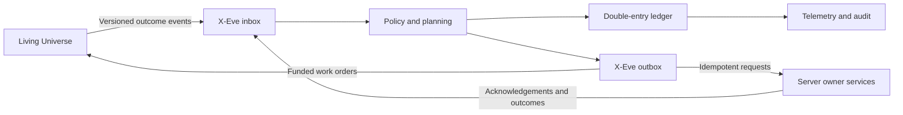

# X-Eve Economic Foundation

## Status

X-Eve is a separate economic and command layer built on top of the Living Universe. It is disabled by default while its accounting, persistence, recovery, and performance boundaries are verified. Enabling Living Universe does not implicitly enable X-Eve.

The bounded foundation described here does not replace the existing market, Living Economy, corporation wallet, contract, industry, or inventory services. It establishes the durable transaction and scheduling rules those services can integrate with in later slices.

## Design goal

The universe must function without the player. Corporations mine, transport, manufacture, consume, fight, lose ships, and respond to shortages because their own plans and balance sheets require it. The player begins as one participant in that system, not its indispensable operator. Player opportunities arise from real economic needs, but ignored work can eventually be completed by NPCs.

Living Universe and X-Eve have deliberately different responsibilities:

- **Living Universe** owns pilot identity, ships, routes, travel, physical materialization, mining, combat, loss, and presence in Local.
- **X-Eve** owns economic accounts, firms, budgets, inventory claims, demand, work orders, contracts between actors, and strategic planning.
- Existing server services remain authoritative for player-visible wallets, market orders, contracts, inventory, industry jobs, and structures.

X-Eve is not allowed to move a ship directly, change a player wallet by reaching into its state table, or silently replace missing market stock. It asks the authoritative owner to perform an operation and records the result.

## Foundation state

The foundation uses a dedicated SQLite-backed runtime table. Its logical groups are:

- `accountsByID`: economic accounts and their current materialized balances;
- `transactionsByID`: immutable committed ledger postings;
- `inboxByID`: accepted events from Living Universe and other owner services;
- `outboxByID`: durable requests that must cross an ownership boundary;
- `receiptsByOperationID`: durable acknowledgements returned by owner services;
- `sourceEventsByID`: one durable authoritative-source event to ledger-transaction mapping;
- `workOrdersByID`: persistent economic work awaiting assignment, execution, or settlement;
- `meta`: schema version, durable sequences, timestamps, and aggregate counters.

Frequently updated entity groups are persisted as individual SQLite rows. A ledger commit validates every change before writing and performs all writes synchronously in one event-loop turn, allowing gameStore to persist the affected rows as one SQLite operation. A ledger commit never waits for the market daemon, a wallet service, ship simulation, or any other external dependency.

Committed transactions are never edited. Corrections are new reversing or compensating transactions that reference the original posting. Startup performs a strict audit before X-Eve is admitted: every committed row must be canonical, individually balanced, fingerprint-valid, backed by valid accounts, and consistent with its source-event index and aggregate metadata. An uncertain rollback quarantines the table so the ordinary save timer and shutdown flush cannot overwrite the last known-good disk image; only a clean audit resumes persistence.

## Accounting invariants

These rules are mandatory across every future X-Eve feature.

### Zero-sum postings

For each currency or item type in a transaction, all signed entries must sum to zero. A transfer of 10 million ISK from a corporation to a hauler is a 10 million debit to the corporation and a 10 million credit to the hauler. It is not two unrelated wallet adjustments.

ISK issuance and retirement remain mathematically balanced by using named external accounts. An empire mission subsidy transfers value from an explicit fiscal-issuance account. A tax or fee transfers value into an explicit retirement or government-revenue account. This makes faucets and sinks visible without pretending they are ordinary private-sector trade.

An ordinary transfer is also required to have zero net effect on tracked money supply. A caller cannot manufacture ISK by creating an off-book or negative account and transferring from it into a cash account. Positive supply changes must use the opening-balance or issuance boundary; negative changes must use the retirement boundary.

Material movements use the same principle. Ore moves from a resource account to a ship, then to a station, refinery, factory, consumer, destroyed-assets account, or external-export account. It cannot exist simultaneously at its source and destination.

### Exact units

ISK amounts are represented as integer cents stored in JSON-safe decimal strings. Item quantities are non-negative integers. Floating-point arithmetic is not authoritative for balances.

Ordinary cash and inventory accounts cannot become negative. Explicit policy accounts, such as an external fiscal counterparty, may have different balance rules, but that exception is declared on the account and remains visible in telemetry.

### Idempotency

Every externally caused posting has a deterministic idempotency key derived from its authoritative source, such as a delivery ID, contract settlement ID, industry completion ID, or ship-loss ID. A durable source-event index prevents the same authoritative event from being committed under a second transaction ID.

- Repeating the same key with the same normalized payload returns the original result and creates no new value.
- Repeating the key with a different payload is rejected as a conflict.
- Within the X-Eve ledger, a restart or duplicate event cannot post the same economic effect twice. Native wallet, cargo, inventory, and market mutations gain the same guarantee only after their owner-service outbox adapters are implemented and verified.

The foundation therefore provides exactly-once internal ledger effects on top of event delivery that may be at least once; it does not yet claim exactly-once behavior for external server services.

### Auditability

Every committed transaction records its event or work-order origin, category, posting time, participants, account entries, and payload digest. Aggregate status is maintained incrementally so normal telemetry does not scan the full ledger.

At any time the following must hold:

- total ledger imbalance is zero for every tracked asset;
- no bounded account is negative;
- every completed inbox event names its resulting transaction or deliberate no-op outcome;
- every acknowledged outbox operation names its external result;
- every reserved material or ISK amount has exactly one owner and lifecycle state;
- every correction preserves the original record and adds an auditable reversal.

## Inbox boundary

Other subsystems communicate with X-Eve through a small versioned event API. They do not mutate X-Eve persistence directly. A typical event contains:

- a globally unique event ID;
- event type and schema version;
- producer name and occurrence time;
- stable IDs for the relevant actor, corporation, ship, station, system, job, or encounter;
- a bounded normalized payload;
- an optional causation and correlation ID.

The inbox accepts an event before processing it. Duplicate event IDs are deduplicated. Under normal load, dirty X-Eve state is handed to the durable SQLite journal at least every two seconds; Living Economy additionally requests a handoff every 64 newly accepted events. Its replay journal retains 4,096 recent events as recovery insurance. X-Eve disables the generic quiet-period flush for its own table and uses these controlled handoffs instead. At the gameStore flush boundary, a synchronous source prerequisite checkpoints the Living Economy journal before any X-Eve sink row can enter the SQLite persistence journal. This rule also covers direct ledger flushes and the generic shutdown flush: source-only state is recoverable, while sink-only state is forbidden. The batching avoids one synchronous SQLite round-trip per event while keeping the replay window far larger than the uncheckpointed batch. Event handlers produce a deterministic ledger transaction, work order, outbox request, or documented no-op, then replace the inbox row with one compact event receipt.

The Living Economy-to-X-Eve bridge is fail-closed. It tracks both accepted sink events and source generations, and reserves 1,024 rows of the 4,096-row replay journal. If a source checkpoint or sink handoff fails, X-Eve reports unhealthy persistence, or 3,072 events remain unconfirmed while handoff is blocked, the bridge opens a hard backpressure circuit. The event that exposed the failure is retained in the Living Economy journal, that source journal is synchronously persisted before the failed pulse unwinds, and further Living Economy pulse work and event-producing Living Universe flight/conflict transitions pause before unconfirmed events can roll out of the replay window. Player gameplay and the main space tick continue. Same-process recovery checkpoints the exact in-memory journal snapshot before replaying it; startup performs the same replay from the already durable journal as a second recovery path. Production resumes only after persistence recovery, complete replay, and a confirmed sink handoff. A universe reset is rejected while an asynchronous economy pulse is active; otherwise it drains the old source, assigns a source epoch strictly newer than the prior epoch, stages the new economy and universe roots, and commits both with one checked table flush. Rollback is not finalized until both old roots are restored by the same boundary; a failed rollback suspends the shared table rather than allowing a mixed cache to flush later. A failed shutdown flush remains retryable and exits unsuccessfully rather than reporting a clean stop.

Circuit state is included in Living Economy performance telemetry: open/closed state, pause reason and time, unconfirmed and unreconciled event counts, source and durable generations, source-checkpoint latency, journal capacity and reserve, handoff attempts/results, automatic recovery attempts, trip and recovery totals, and reconciliation failures. This is a safety circuit, not a queue-clearing mechanism: it never discards an event or shortens simulated travel or production time to catch up.

Events contain facts, not entire mutable world objects. For example, a freight completion event describes the manifest, source, destination, carrier, and completion time. It does not copy a full Living Universe flight or scene graph into X-Eve state.

## Outbox boundary

Player wallets, corporation wallets, market orders, contracts, inventories, structures, and physical ships remain owned by their existing services. These operations cannot participate in the same local atomic commit as the X-Eve ledger, so they use a durable outbox.

The intended flow for the later live adapter is:

1. Validate the economic decision.
2. Commit its X-Eve transaction intent and deterministic outbox operation ID.
3. Ask the authoritative service to perform the external operation.
4. Record the acknowledgement and finalize settlement.
5. On timeout or restart, reconcile the known operation ID before retrying.

An uncertain result is never treated as an automatic failure and blindly repeated. If an owner service lacks idempotent mutation support, its X-Eve adapter must add a durable reference ledger before that integration can become live.

The current foundation persists outbox records but does not yet dispatch or recover an external mutation. That adapter and its fault-injection verification remain an acceptance gate before X-Eve may change a native wallet, inventory, market order, contract, structure, or ship.

The outbox will also be how X-Eve issues funded work to Living Universe. X-Eve defines the objective, budget, cargo reservation, risk policy, and deadline. Living Universe chooses or materializes qualified pilots and ships, executes the physical activity, and reports authoritative outcomes through the inbox.

## Deadline-driven scheduler

X-Eve runs outside the 100 ms space tick. Work is stored with its next useful deadline in an indexed queue. A short independent scheduler pass processes a bounded number of due records within a bounded synchronous work budget.

Work classes are ordered by consequence:

1. recovery and reconciliation of uncertain commits;
2. acknowledgement and settlement of already completed external work;
3. time-critical contractual deadlines;
4. ordinary production, payroll, procurement, and logistics completions;
5. new planning, opportunity discovery, repricing, and long-range strategy.

When capacity is constrained, X-Eve delays lower-priority decisions. It does not shorten travel or production time, discard work, lose an economic event, or create a catch-up payment. A late completion is settled with its authoritative completion time when processed.

Handlers must be small and restart-safe. Registration requires an explicit synchronous-continuation contract with a slice budget no larger than 2 ms. They receive invocation-scoped, non-durable ledger capabilities—not the raw runtime, state store, account-creation API, full-ledger audit, or synchronous flush APIs—and those capabilities close as soon as the handler returns. Every monetary mutation is bound to the work order's stable effect ID and requested deadline as its transaction ID, source-event ID, and effective time. A handler may make one monetary mutation per invocation; a multi-account result belongs in one balanced `commit`. If a handler posts and then throws, its retry replays that same transaction rather than paying twice. Caller-supplied attempt IDs are rejected.

A normal function that returns a Promise is treated as an uncertain outcome: its work and handler type are quarantined, the quarantine is synchronously persisted, and the work is never retried. A handler cannot both make a monetary ledger effect and reschedule the same work order: that unsafe continuation is quarantined instead of silently replaying or duplicating a later slice. A handler that violates its slice contract is barred from further work; a 600 ms violation also trips the unplayable-handler counter. Handler-level quarantine receipts survive restart even when the offending work completed successfully. Large regional scans are divided into cursor-based slices and yield cooperatively.

Runtime startup audits inbox rows, work orders, and receipts before attempting recovery. Every row retains an immutable request envelope and SHA-256 fingerprint. The audit rejects invalid classes or statuses, altered fingerprints, mismatched inbox/receipt pairs, orphaned event work, unknown active handlers, and invalid internal ID relationships without flushing ambiguous state. Valid interrupted work is recovered only after this read-only audit, then a second audit runs before the one recovery flush. Scheduler telemetry records queue depth, overdue work, processed and deferred counts, quarantines, mode, pass duration, maximum uninterrupted slice, durability handoff age/duration, and failure/retry counts.

## Latency protection modes

The performance baseline is a 100 ms server tick interval. X-Eve uses rolling measurements rather than reacting aggressively to one ordinary outlier.

| Tick condition | X-Eve mode | Behavior |
| --- | --- | --- |
| 100 ms | Baseline | Zero-lag reference. |
| Below 120 ms p95 | Normal | Full configured scheduler budget and normal planning volume. |
| 120 ms to below 130 ms p95 | Constrained | Defer planning and maintenance. Admit at most one tiny settlement or deadline continuation. |
| At or above 130 ms p95 | Deadlines only | Pause new planning, discovery, broad repricing, and long-range strategy. Process recovery, acknowledgements, and due settlements only. |
| At or above 500 ms, even during startup warm-up | Hard shed | Stop all deferrable X-Eve work immediately. Preserve queues and finish only the minimum safe atomic bookkeeping already in progress. Emit a capacity warning. |
| At or above 600 ms, even during startup warm-up | Unplayable | Treat the server as operationally unplayable. X-Eve remains shed while the underlying performance problem is diagnosed and recovered. |

A brief interval above 130 ms is tolerated when the rolling p95 and sustained-pressure counters remain healthy. Mode recovery uses hysteresis: the scheduler must observe five seconds with p95 below the configured 115 ms recovery threshold before returning to normal. This prevents rapid switching and a deferred-work surge immediately after pressure falls.

The 500 and 600 ms values are emergency boundaries, not acceptable operating targets. Normal development still aims for approximately 100-110 ms, with 120-130 ms used only as limited headroom.

## Disabled-by-default behavior

The foundation is gated by `xEveEnabled`, which defaults to `false`. When disabled:

- no X-Eve scheduler timer is started;
- no X-Eve accounts or opening balances are seeded;
- no Living Universe or market behavior changes;
- no wallet, inventory, contract, order, industry, or structure mutation occurs;
- read-only validation and explicit verification scripts may still exercise injected or temporary stores.

Enabling the flag in a later development slice must be explicit. It must not be inferred from Living Universe, Living Economy, family-estate, market, or live-event settings.

## Verification

From the `server` directory, run `npm run verify:x-eve`. The suite uses isolated temporary databases and does not start or modify the game server. It fault-injects malformed ledger state, duplicate events, interrupted work, post-then-fail retries, asynchronous handlers, slow handlers, source-checkpoint failures, blocked sink handoffs, journal backpressure, and recovery without restart.

The latest July 21 development run measured a 64-event sink batch at about 4.0 ms and a full 4,096-event source-before-sink checkpoint at about 30 ms. Replaying 4,096 events and auditing them on restart took about 247 ms and 196 ms respectively. Those two recovery-only operations can briefly exceed the 130 ms play target, as permitted, but remained far below the 600 ms unplayable boundary. The suite also rejects malformed or regressed source journals, thrown barrier registration, periodic persistence failure, unsafe post-effect continuations, failed source-reset drains, and resets attempted during an active economy pulse; it directly verifies a paired economy-and-universe root commit and that the runtime and persistence boundary retain and report a failed flush for retry. These are workstation measurements, not universal capacity claims; live telemetry remains authoritative on each host.

## Current exclusions

The bounded foundation deliberately does not yet provide:

- player or corporation wallet payments;
- NPC market-order placement or replacement of the existing procurement system;
- live inventory, escrow, contract, or industry-job mutation;
- recurring estate income, payroll, rent, taxes, loans, insurance, or dividends;
- a regional price model or production planner;
- NPC hiring, fleet command, or employee role assignment;
- strategic faction budgets, campaigns, wars, insolvency, or mergers;
- migration of existing Living Economy shadow metrics into authoritative accounts;
- long-horizon receipt compaction or archival beyond the bounded test horizon;
- removal or reset of existing market and world state;
- new chat commands or a patched client interface;
- private deployment addresses, credentials, invite tokens, or machine-specific configuration.

These exclusions are safety boundaries. They prevent an unfinished economic kernel from duplicating money or materials in the running world.

Before any native market or wallet mutation is enabled, procurement fills must gain a stable fill operation ID, funded escrow reconciliation, and a failure-atomic inventory/order/wallet outbox. The existing owner-service path cannot yet prove that a timeout after consuming an item will neither lose the item nor pay twice. Long-running operation receipts also need a compact durable identity index and archival policy before multi-day capacity results can be extrapolated indefinitely. These are explicit enablement gates, not work delegated to the performance governor.

## Staged roadmap

### Stage 0: Foundation

Implement and verify the dedicated state store, zero-sum ledger, deterministic idempotency, inbox, outbox, deadline queue, load governor, telemetry, and restart recovery. Keep the feature disabled by default and prove that it has no effect when disabled.

### Stage 1: Read-only observation

Ingest a limited set of Living Universe outcomes into the inbox without changing gameplay. Mirror deliveries, mining returns, industry completions, cargo losses, ship losses, and campaign consumption into shadow X-Eve accounts. Compare X-Eve conservation totals with the existing economy telemetry and resolve discrepancies before enabling external mutations.

### Stage 2: One closed production chain

Make one Forge-region chain authoritative end to end: mined ore, mineral refinement, ammunition or drone production, real transit, military or civilian consumption, and replacement demand. Use named opening balance sheets and controlled external accounts. Players and NPCs should be interchangeable suppliers of the same funded need.

### Stage 3: Estate company and early work

Give the shared family estate a finite operating balance, actual liabilities, material-backed restoration needs, and a small employee roster. Generate courier, mining, escort, salvage, repair, and procurement work from real shortages. The prototype's synthetic recurring estate revenue is automatically paused whenever X-Eve is enabled.

### Stage 4: Regional firms and logistics

Introduce persistent corporations with target inventory, cash reserves, production capability, route risk, margins, and solvency. Expand from The Forge into adjacent regions, then connect the four empire trade networks and nearby low-security resource corridors.

### Stage 5: Strategic demand

Fund faction security, pirate activity, campaigns, structure upkeep, reserves, and replacement programs from explicit budgets. Combat consumes ammunition and ships; losses create ordinary procurement and production demand. Factions continue operating whether the player participates or not.

### Stage 6: Advanced industry and outer regions

Add research, blueprint copying, invention, reactions, T2 production, capitals, null-security economies, pirate supply networks, wormhole resources, civilian consumption, credit, insurance, and insolvency resolution.

### Stage 7: Optional client presentation

Only after the native market, contracts, corporation projects, wallet, fleet, mail, and agent interfaces have been exhausted should a client patch be considered. A patch would consolidate visibility and controls; it must not become necessary for economic correctness.

## Read-only foundation acceptance gates

The foundation is ready for read-only integration only when verification demonstrates:

- zero imbalance after valid transfers, issuance, retirement, and reversals;
- no state change after an invalid or unbalanced posting;
- no duplicate effect from replayed events or work completions;
- a failed or stalled source checkpoint or sink handoff pauses Living Economy before replay-journal rollover, and automatic or startup reconciliation admits every retained event before production resumes;
- conflict rejection when one idempotency key is reused with different data;
- persistence across a clean restart, fail-closed startup audit, and suppression of already-completed work after interruption;
- bounded scheduler work and queue preservation in every latency mode;
- no active scheduler or world mutation while disabled;
- O(1) routine status reporting without scanning the complete ledger;
- no private deployment information in source, logs intended for release, or documentation.

These gates permit Stage 1 shadow observation only. They do not authorize a player payment, item movement, order, contract, structure change, or ship command.

Before any external mutation is enabled, a real outbox adapter must additionally prove idempotent dispatch, acknowledgement, timeout, uncertain-result reconciliation, and restart recovery under fault injection. Long-horizon receipt retention/compaction must also be sized and tested. Only after those live-mutation gates pass should X-Eve be allowed to pay a player, place a market order, transfer an item, or direct a Living Universe ship.
